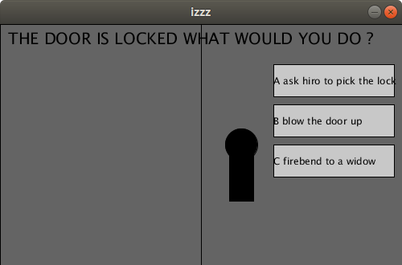
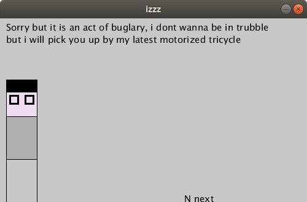
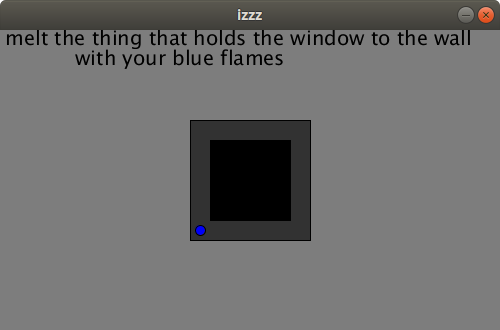

# W1ll13
Code and more created by Sonia...

## Izzzz

The tool she was using is processing:
https://processing.org/

If you download the app and open the izzz.pde file, you'll see what she did.

The first screen is a door with 3 choices : A, B, C

If you choose A : 

B : Game Over

